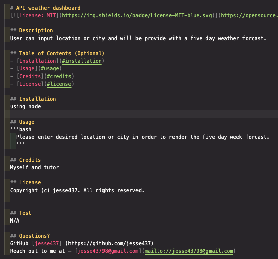

# 1. Node Professional README Generator

### Welcome to my first project using Node. This project is my introduction to Node.

# Description

### In this project we are creating a README.md file using Node and Javascript.
### This will ease the user experience because it will render a readme file in a easy use and time saving process. The user will be able to access the finished readme in a separate file.

# 2. User Story

- AS A developer
- I WANT a README generator
- SO THAT I can quickly create a professional README for a new project

# 3. How to use 

### First the user will be presented with the project and will open the terminal from the correct file in this case index.js. Then the user will type in node index.js in the terminal and will be prompted to answer several questions. These question when answered will create the README.md file. When finshed the final README will show in a seperate file named output.

# 4. Deployment 

### N/A

# 5. Visuals

<video controls src="node-generator-video.mp4" title="Title"></video>

# 6. Collaborators

[Jesus Ruiz Gutierrez](https://github.com/jesse437)

# 7. Technologies Used

- JavaScript and Node.js
